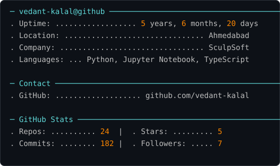

<!-- HERO ANIMATION -->

  

<table align="center">
  <tr>
    <td></td>
    <td valign="top"></td>
  </tr>
</table>

<code>&gt; identity_matrix.load("vedant-kalal") ... access granted ⚡</code>

Hi, I'm **Vedant Kalal** — an **AI & Machine Learning Engineer**, currently pursuing **B.Tech in CSE (AI/ML)** at **New LJ Institute of Technology, Ahmedabad (4th Year)**.
I have hands-on industry experience from a **6-month AI/ML internship at Sculptsoft** and am currently working there **part-time as an AI/ML Engineer**.

I am specializing in **Applied AI, Data Science, Machine Learning, Deep Learning, Backend Systems, Agentic AI, Prompt Engineering, and RAG-based LLM architectures**.

🥈 **1st Runner-Up – Maveric Effect AI Challenge 2025**
🚀 Built multiple **real-world, production-ready AI applications**

## 📡 Connect

  
  
  

## ⚡ Tech Stack

### 🗣️ Programming Languages

### 🧠 Artificial Intelligence & Machine Learning

### 🤖 Agentic AI, LLMs & Prompt Engineering

### 📊 Data Science & Data Cleaning

### 📈 Data Visualization

### 🧿 Computer Vision & OCR

### ⚙️ Backend Development & APIs

### 🗄️ Databases & ORM

### ☁️ Cloud, DevOps & Tooling

## 🟩 Contribution Activity

  

## 📊 GitHub Stats

  

👁️ <b>Profile Views</b>  

  

